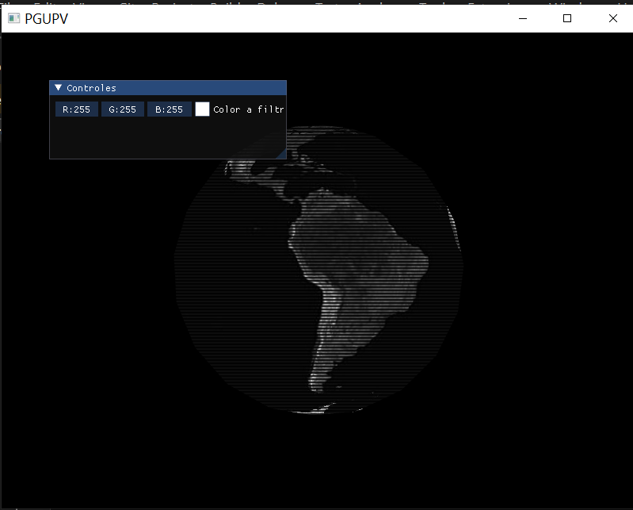
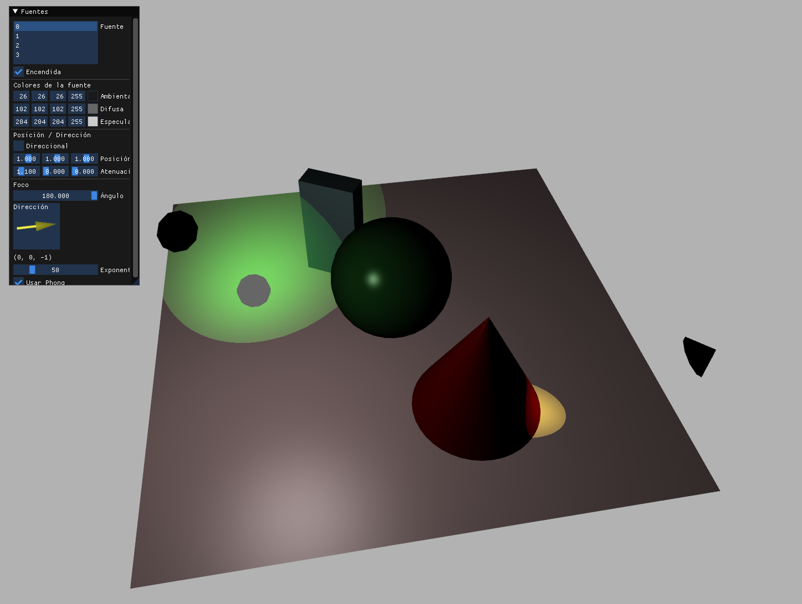
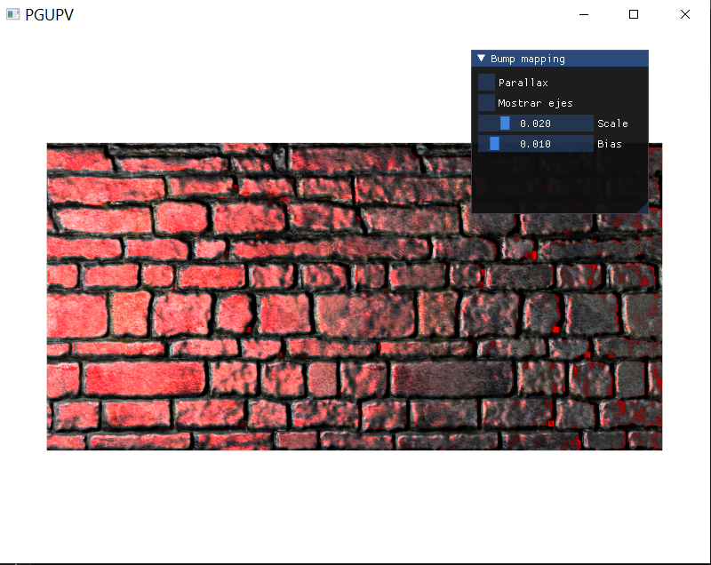
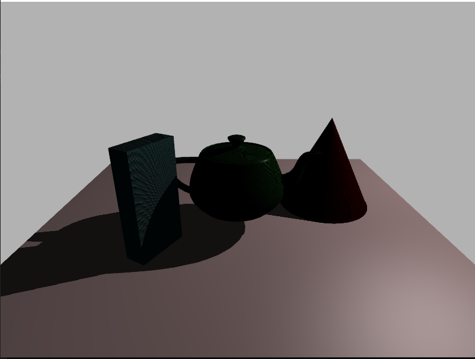
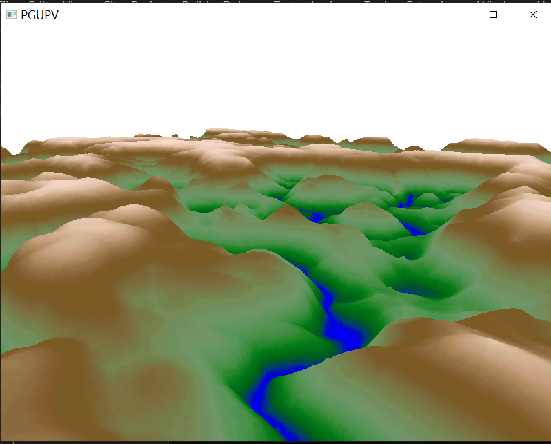

# Rendering practice
Collection of experiments I did to practice different 3D rendering techniques in OpenGL. 
It includes: 
- Usage of basic shader

- Gouraud/Phong lighting 

- Bump Mapping 

- Shadow Mapping

- Tesselation

- Physically Based Rendering (WIP)